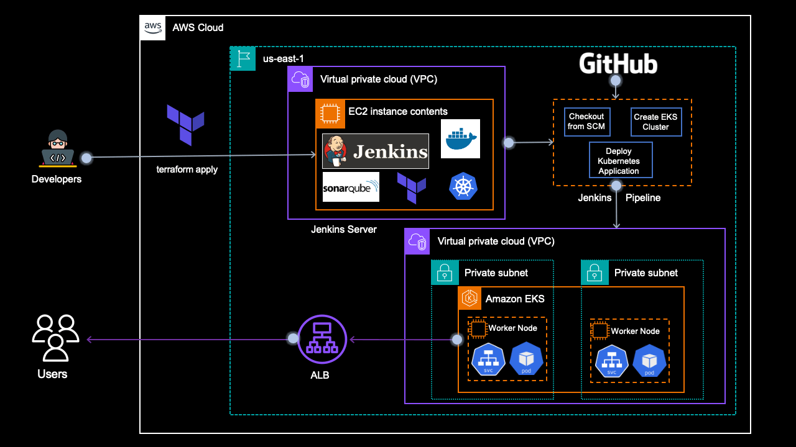

# From Scratch to Production: Deploying EKS Clusters and Applications with CI/CD using Jenkins and Terraform



## Streamlining EKS Deployment and CI/CD: Automating Application Delivery with Jenkins and Terraform

In this project, I have created a fully functional EKS cluster and a simple containerized application up and running, with a CI/CD pipeline that automates the entire process from code to production.

### Let's get started!

### **What we'll build**

We are going to build and deploy a lot of things. Here is the outline for our project:

**I. Setting up Jenkins Server with Terraform**

* Creating an EC2 instance with Terraform.

* Installing necessary tools: `Java, Jenkins, AWS CLI, Terraform CLI, Docker, Sonar, Helm, Trivy, Kubectl`.

* Configuring Jenkins server.

**II. Creating EKS Cluster with Terraform**

* Writing Terraform configuration files for `EKS` cluster creation in a private subnet.

* Deploying EKS cluster using Terraform.

**III. Deploying NGinx Application with Kubernetes**

* Writing Kubernetes manifest files `(YAML)` for the NGinx application.

* Deploying NGinx application to `EKS` cluster.

**IV. Automating Deployment with Jenkins CI/CD**

* Creating `Jenkins` pipeline for automating EKS cluster creation and Nginx application deployment.

* Integrating Terraform and Kubernetes with the Jenkins pipeline.

* Configuring continuous integration and deployment (CI/CD).

### **What we'll need**

To embark on our CI/CD adventure, we'll need a trusty toolkit:

**Terraform** — To create configuration files for the EC2 instance which will be used as a Jenkins server and EKS Cluster in a VPC.

**Shell Script —** To install command line tools in the EC2 instance.

**Jenkins file —** To create a pipeline in the Jenkins Server.

**Kubernetes Manifest files** — To create a simple NGINX application in the EKS cluster.

### **Source Code**

You can download the complete source code inside this repository

### **Prerequisites**

Before creating and working with the project, set up some dev tools -

1. It's better to have an IDE to develop your project. I am using `Visual Studio Code` for the same. You can install it from the following link based on the operating system— [https://code.visualstudio.com/download](https://code.visualstudio.com/download)

2. Install the CLI tools — [**AWS-CLI**](https://docs.aws.amazon.com/cli/latest/userguide/getting-started-install.html), and [**Terraform-CLI**](https://developer.hashicorp.com/terraform/tutorials/aws-get-started/install-cli).

3. We need AWS Free Tier Account. And then create a user in IAM Console and finally create an `Access Key ID` and `Secret Access Key` in AWS Console for that user. You need to download these keys and then export those credentials in your terminal as follows —

```yaml
export AWS_ACCESS_KEY_ID=<Copy this from the credentials file downloaded>
export AWS_SECRET_ACCESS_KEY=<Copy this from the credentials file downloaded>
```

### **Stage 1: Configure and Build Jenkins Server**

1. Create Key pairs for the EC2 instance

2. Create `S3` bucket to store terraform remote states.

3. Write terraform configuration files for `EC2 instance` which will be used as a `Jenkins` server. So, we will create the instance first and then we will install the necessary tools like `jenkins` etc via a build `script`.

4. write build `script` for installing `Java`, `Jenkins`, `Git`, `Docker`, `sonarqube-container`, `Aws-cli`, `Terraform`, `kubectl`, `trivy`, `helm`  in file called *install\_build\_tools.sh*

      Please note a few points before running `terraform apply`.

    * Use the correct key pair name in the EC2 instance  module `(main.tf)` and it must exist before creating the instance.

    * Use the correct bucket name in the configuration for the `remote` backend `S3` in the`backend.tf`

    * You need to use `user_data = file("../scripts/install_build_tools.sh")` in the EC2 module to specify the script to be executed after EC2 instance creation.

5. In jenkins_server directory, Run `terraform init` , `terraform validate` and `terraform plan`.
6. export `export AWS_ACCESS_KEY_ID` and `AWS_SECRET_ACCESS_KEY` if needed and then run `terraform apply -var-file=variables/dev.tfvars -auto-approve`

    Jenkins Build Server Created

7. log in to the Jenkins server and verify if all the tools have been installed correctly or not.


### **Stage 2: Create Terraform configuration files for creating the EKS Cluster**

#### **Task 1: Create Terraform configuration files**

Moving on, let's start writing terraform configurations for the `EKS` `cluster` in a `private` `subnet`.

We'll use the same bucket but a different key/folder for the`terraform remote state` file.


Write Terraform configuration files for backend, vpc, and EKS.

Make sure to use a `private subnet` for our `EKS` `cluster` as we don't want it to be publicly accessed.

#### **Task 2: Validate the terraform configuration files**

Although we are going to create the AWS EKS infrastructure via the Jenkins pipeline, we first need to validate the configuration files that we have created in the previous step.

```yaml
terraform init

terraform validate

terraform plan
```

Configuration files are all validated and `terraform plan` is running fine which means we are ready to run the `terraform apply` in the Jenkins pipeline.

### **Stage 3: Configure Jenkins pipeline**

Proceed to the Jenkins URL and configure the pipeline.


Configure Pipeline

> *Jenkinsfile*

```yaml
pipeline{
    agent any
    environment {
        AWS_ACCESS_KEY_ID = credentials('AWS_ACCESS_KEY_ID')
        AWS_SECRET_ACCESS_KEY = credentials('AWS_SECRET_ACCESS_KEY')
        AWS_DEFAULT_REGION = "us-east-1"
    }
    stages {
        stage('Checkout SCM') {
            steps {
                script {
                    checkout scmGit(branches: [[name: '*/main']], extensions: [], userRemoteConfigs: [[url: 'https://github.com/Muntazir17/Deploying-EKS-Clusters-and-App-with-CI-CD-using-Jenkins-and-Terraform.git']])
                }
            }
        }
        stage('Initializing Terraform'){
            steps {
                script {
                    dir('tf-aws-eks'){
                        sh 'terraform init'
                    }
                }
            }
        }
        stage('Validating Terraform'){
            steps {
                script {
                    dir('tf-aws-eks'){
                        sh 'terraform validate'
                    }
                }
            }
        }
        stage('Terraform Plan'){
            steps {
                script {
                    dir('tf-aws-eks'){
                        sh 'terraform plan -var-file=variables/dev.tfvars'
                    }
                }
            }
        }
    }
}
```

Copy and Save the code and click on `Build Now` If everything is correct, you will see something similar to below.


Check the logs, We can see that the pipeline is successful and `terraform plan` got executed.


Now, add one more steps in the `Jenkinsfile` for `terraform apply` and then click on `Save` and `Build Now`.

Here is the updated code for the pipeline.

> *Jenkinsfile*

```yaml
pipeline{
    agent any
    environment {
        AWS_ACCESS_KEY_ID = credentials('AWS_ACCESS_KEY_ID')
        AWS_SECRET_ACCESS_KEY = credentials('AWS_SECRET_ACCESS_KEY')
        AWS_DEFAULT_REGION = "us-east-1"
    }
    stages {
        stage('Checkout SCM') {
            steps {
                script {
                    checkout scmGit(branches: [[name: '*/main']], extensions: [], userRemoteConfigs: [[url: 'https://github.com/vishal2505/terraform-eks-cicd.git']])
                }
            }
        }
        stage('Initializing Terraform'){
            steps {
                script {
                    dir('tf-aws-eks'){
                        sh 'terraform init'
                    }
                }
            }
        }
        stage('Validating Terraform'){
            steps {
                script {
                    dir('tf-aws-eks'){
                        sh 'terraform validate'
                    }
                }
            }
        }
        stage('Terraform Plan'){
            steps {
                script {
                    dir('tf-aws-eks'){
                        sh 'terraform plan -var-file=variables/dev.tfvars'
                    }
                    input(message: "Are you sure to proceed?", ok: "Proceed")
                }
            }
        }
        stage('Creating/Destroying EKS Cluster'){
            steps {
                script {
                    dir('tf-aws-eks'){
                        sh 'terraform $action -var-file=variables/dev.tfvars -auto-approve' 
                    }
                }
            }
        }
    }
}
```
add parameters

Now, run the pipeline again by clicking on `Build with Parameters` —


`Pipeline running`

We need to wait at least 15 mins for the pipeline to be finished.

`Pipeline Success`

Verify the EKS cluster in the AWS Console.

EKS Cluster — Created

### **Stage 4: Adding Kubernetes manifest files for the Nginx Application**

We have come to the last stage where we are going to **deploy** a simple Kubernetes application to the cluster. 

We are going to create a simple Nginx application that we are going to access via the `LoadBalancer` endpoint. Hence, let's create 2 manifest files — `deployment.yaml` and `service.yaml`

> *deployment.yaml*

```yaml
apiVersion: apps/v1
kind: Deployment
metadata:
  name: nginx
spec:
  selector:
    matchLabels:
      app: nginx
  replicas: 1
  template:
    metadata:
      labels:
        app: nginx
    spec:
      containers:
      - name: nginx
        image: nginx
        ports:
        - containerPort: 80
```

> *service.yaml*

```yaml
apiVersion: v1
kind: Service
metadata:
  name: nginx
  labels:
    app: nginx
spec:
  ports:
  - name: http
    port: 80
    protocol: TCP
    targetPort: 80
  selector:
    app: nginx
  type: LoadBalancer
```

Keep these files in another directory for example `manifest` . And also add another stage in the Jenkins pipeline. This stage is gonna apply manifest files using `kubectl` utility that we installed in the EC2 instance (Jenkins Server) initially.

> *Jenkinsfile*

```yaml
stage('Deploying Nginx Application') {
            steps{
                script{
                    dir('manifest') {
                        sh 'aws eks update-kubeconfig --name my-eks-cluster'
                        sh 'kubectl create namespace eks-nginx-app'
                        sh 'kubectl apply -f deployment.yaml'
                        sh 'kubectl apply -f service.yaml'
                    }
                }
            }
}
```


eks-cicd-pipeline successful
Validate the resources in the AWS EKS console -


nginx deployment is running

nginx service is running

Now copy the load balancer URL and hit it in the browser. We'll be able to access the application.

Nginx application is running in the browser

### **Stage 5: Teardown resources**

Finally, At the end, We have to destroy our resources to save on the cost. Deleting applications and destroying `EKS` cluster can be done via the Jenkins pipeline by just selecting the `action` `destroy` while doing `Build with Parameters`.


Action — destroy

Destroy Pipeline

EKS Cluster — Deleted

Also delete the `Jenkins` `Server` by running `terraform destroy` via local CLI.

`terraform destroy`

terraform destroy completed

Please recheck your AWS Console manually to see if there is any resource remaining for example — EC2 key pair and S3 bucket and delete them manually.

### **Conclusion**

We have successfully implemented a robust and automated infrastructure provisioning and deployment pipeline using `Terraform`, `EKS`, and `Jenkins`. We have not only designed and implemented a scalable and efficient CI/CD pipeline but also deployed a simple **Nginx** application in the EKS cluster. However, this is not the end but the beginning of creating complex production CI/CD applications.

### **Further Improvements**

There are a lot of areas for improvement in this pipeline. Some of them are as below —

* **CI/CD Pipeline Enhancements:** We can explore additional Jenkins features, such as automated trigger, code review, testing, and artifact management, to further streamline our pipeline.

* **Security Enhancements:** Implement additional security measures, such as network policies, secret management, and role-based access control.

* **Kubernetes Advanced Features:** Experiment with Kubernetes advanced features, like StatefulSets, Deployments, and Persistent Volumes, to improve our application's resilience and efficiency.

* **Monitoring and Logging:** Integrate monitoring tools (e.g., Prometheus, Grafana) and logging solutions (e.g., ELK Stack) to ensure real-time visibility and insights.

# Thank you

Thank you for taking the time to work on this tutorial/labs. Let me know what you thought!

#### Author by [Muntazir](https://github.com/Muntazir17)

